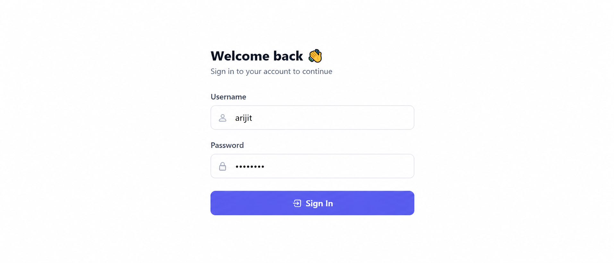
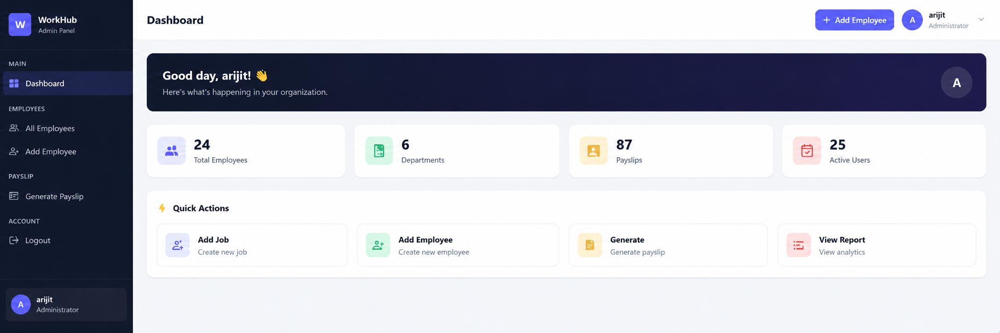
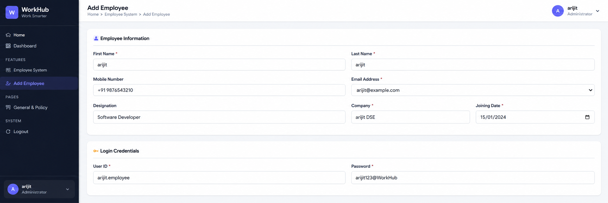
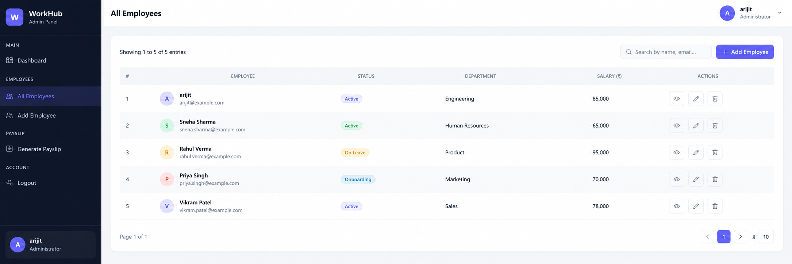
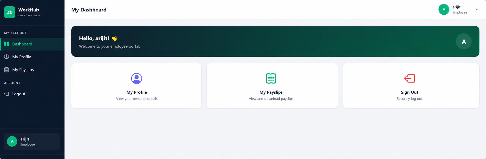
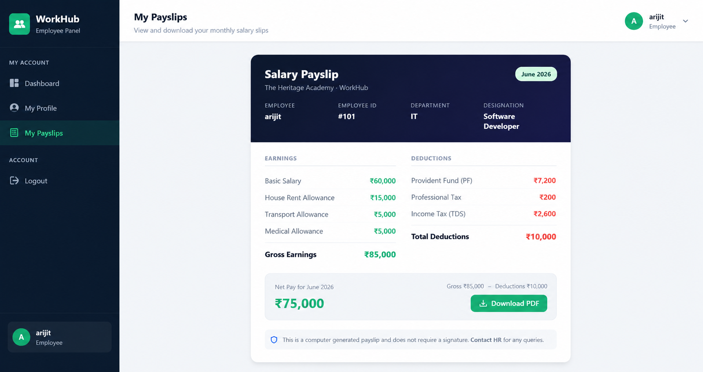

# Employee Management System (EMS)

A web-based Employee Management System developed using Java, JSP, Servlets, JDBC, MySQL, and Apache Tomcat.

This project was created as part of the BCA Semester VI subject **Advanced Java with Web Application**. The application follows the **MVC (Model-View-Controller)** architecture and demonstrates the practical implementation of Java Web Technologies for employee data management and payroll processing.

---

# Project Overview

Employee Management System (EMS) is designed to simplify employee administration within an organization.

The system provides separate portals for:

- Administrators
- Employees

Administrators can manage employee records, maintain organizational data, and generate salary slips, while employees can securely access their personal information and payslip records.

The application demonstrates concepts such as authentication, session management, database connectivity, CRUD operations, role-based access control, and MVC architecture.

---

# Features

## Administrator Module

### Authentication
- Secure Admin Login
- Secure Logout
- Session-Based Authentication

### Dashboard
- Overview of Total Employees
- Department Statistics
- Payslip Statistics
- Active User Information

### Employee Management
- Add New Employee
- Update Employee Information
- Delete Employee Records
- View Employee Details
- Search Employees
- Department-wise Filtering
- Employee Listing

### Payslip Management
- Generate Monthly Payslips
- View Generated Payslips
- Employee Salary Tracking
- Payslip History Management

---

## Employee Module

### Authentication
- Employee Login
- Employee Logout
- Session Management

### Employee Dashboard
- Personal Dashboard
- Account Overview

### Profile Management
- View Personal Details
- View Employment Information

### Payslip Services
- View Payslip History
- Download Payslip PDF
- Access Monthly Salary Records

---

# Technology Stack

| Category | Technology |
|-----------|------------|
| Programming Language | Java |
| Frontend | JSP, HTML5, CSS3, Bootstrap 5 |
| Backend | Java Servlets |
| Database | MySQL |
| Connectivity | JDBC |
| Build Tool | Maven |
| Server | Apache Tomcat |
| Architecture | MVC |

---

# Software Requirements

- JDK 17 or Higher
- Apache Tomcat 9+
- MySQL Server
- Maven
- Eclipse Enterprise Edition / IntelliJ IDEA

---

# Project Architecture

The project follows the MVC Architecture.

### Model Layer
Contains:
- Admin Model
- Employee Model
- Payslip Model

### View Layer
Contains:
- JSP Pages
- HTML
- CSS
- Bootstrap Components

### Controller Layer
Contains:
- LoginServlet
- LogoutServlet
- EmployeeServlet
- DashboardServlet
- PayslipServlet

### Data Access Layer
Contains:
- AdminDAO
- EmployeeDAO
- PayslipDAO

---

# Database Design

The system uses the following database tables:

## admins
Stores administrator credentials and information.

## employees
Stores employee details such as:
- Name
- Email
- Department
- Designation
- Salary
- Joining Date

## payslips
Stores monthly payslip information including:
- Basic Salary
- Bonus
- Deductions
- Net Salary

## audit_logs
Stores user activity and system logs.

---

# Key Concepts Implemented

- MVC Architecture
- Session Management
- Authentication & Authorization
- JDBC Database Connectivity
- Prepared Statements
- CRUD Operations
- Form Validation
- Database Relationships
- Role-Based Access Control
- PDF Payslip Download
- Responsive UI Design

---

# Installation Guide

## Step 1: Clone Repository

```bash
git clone <your-repository-url>
```

## Step 2: Create Database

Import:

```text
database/schema.sql
```

into MySQL.

---

## Step 3: Configure Database

Open:

```text
src/main/java/com/ems/utility/DBConnection.java
```

Update:

```java
private static final String URL = "jdbc:mysql://localhost:3306/ems_db";
private static final String USERNAME = "root";
private static final String PASSWORD = "your_password";
```

---

## Step 4: Build Project

```bash
mvn clean install
```

---

## Step 5: Deploy Application

Deploy generated WAR file to Apache Tomcat.

---

## Step 6: Run Application

```text
http://localhost:8080/EmployeeManagementSystem
```

---

# Default Credentials

## Administrator

Username:

```text
admin
```

Password:

```text
admin123
```

---

# Screenshots

## Login Page



---

## Admin Dashboard



---

## Add Employee



---

## Employee List



---

## Employee Dashboard



---

## Payslip Module



---

# Learning Outcomes

Through this project, the following concepts were implemented and understood:

- Java Web Development
- JSP and Servlets
- JDBC Integration
- MVC Design Pattern
- Session Tracking
- CRUD Functionality
- Database Management
- Authentication Systems
- Web Application Deployment
- Software Project Structuring

---

# Future Enhancements

Possible future improvements:

- Attendance Management Module
- Leave Management System
- Employee Profile Picture Upload
- Department Analytics
- Payroll Reports
- Email Notifications
- REST API Integration
- Cloud Deployment

---

# Developed By

**Arijit Kundu**

Bachelor of Computer Applications (BCA)

Maulana Abul Kalam Azad University of Technology (MAKAUT)

---

# Academic Submission

Submitted as a laboratory project for the subject:

**Advanced Java with Web Application**

Semester VI – Bachelor of Computer Applications (BCA)

Academic Session 2025–26